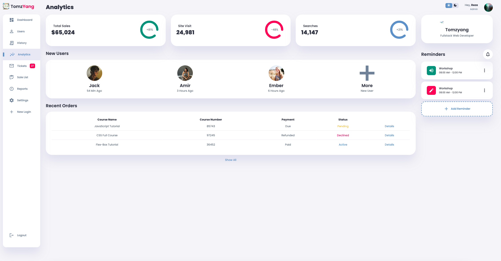
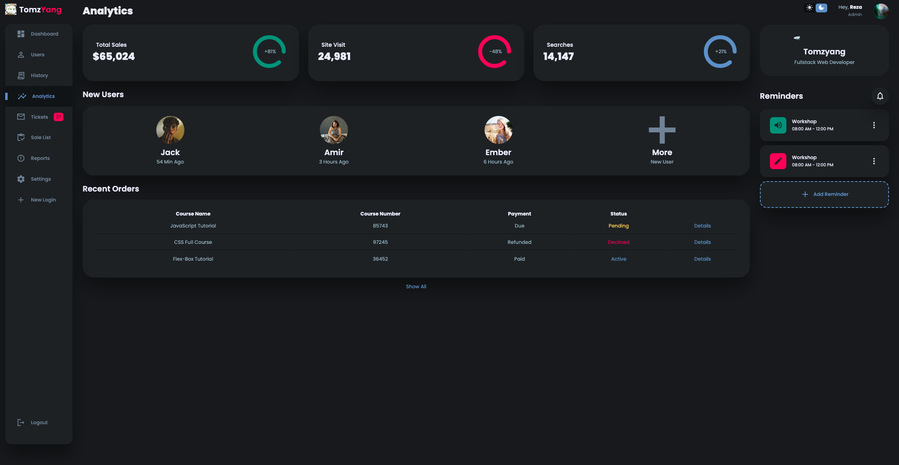

# proj-admin-dashboard

A practice of using HTML5/CSS3/Javascript to create a admin dashboard with a light/dark mode switch

### Prerequisite skills list

- HTML, CSS, and JavaScript 
    - CSS Variables
    - CSS Grid
    - CSS Flexbox
    - CSS  transitions and animations
- RWD dashboard
- `Light` and `Dark` mode theme

### Screenshot
Here we have project screenshot :




### Recommamd to use simplewebserver to run and test
Tools can be downloaded ([here](https://simplewebserver.org/download.html))

### Alternative Server

Use Python's SimpleHTTPServer module to quickly create a temporary web server (Web Server)
```
python -m SimpleHTTPServer [port]
```

### Use mac and macOS to Monterey 12.3

> Anyone updating their macOS to Monterey 12.3 will find that they
> suddenly no longer have the system-provided Python 2.

> The reason for this is that Apple removed the system-provided Python > 2 installation (details).

> So a workaround/solution for this is to use pyenv to install Python > 2.7 (or any other specific version you need).

- Install pyenv with brew to manage different Python versions: 

```
brew install pyenv
```

- List all installable versions
```
pyenv install --list
```
- Install Python 2.7.18 
```
pyenv install 2.7.18
```
- Set global python version
```
pyenv global 2.7.18
```
- Add `eval "$(pyenv init --path)"` to `~/.zprofile` (or `~/.bash_profile` or `~/.zshrc`, whichever you need)

- Relaunch the shell and check that Python works, or run `$ source ~/.zprofile`

### Related Posts
- [How can I fix the "zsh: command not found: python" error?](https://stackoverflow.com/questions/71591971/how-can-i-fix-the-zsh-command-not-found-python-error-macos-monterey-12-3)
